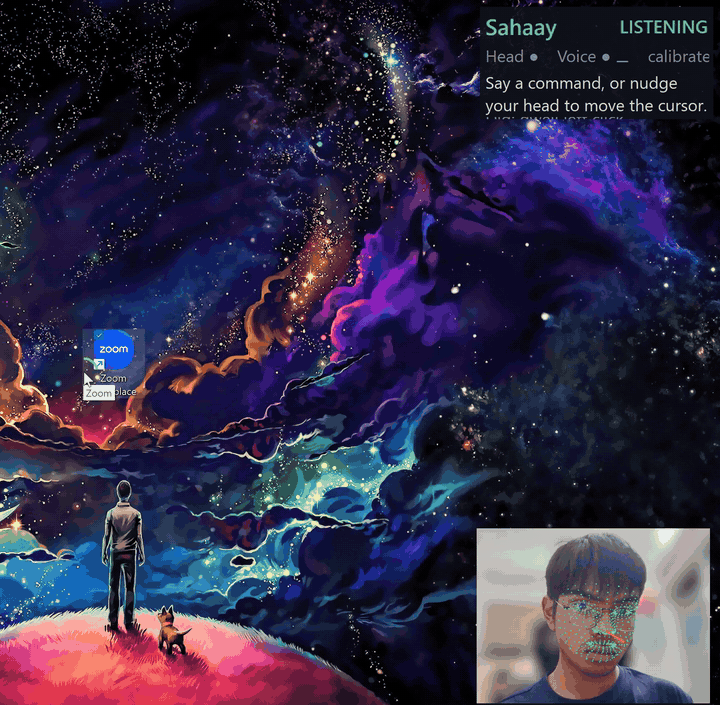
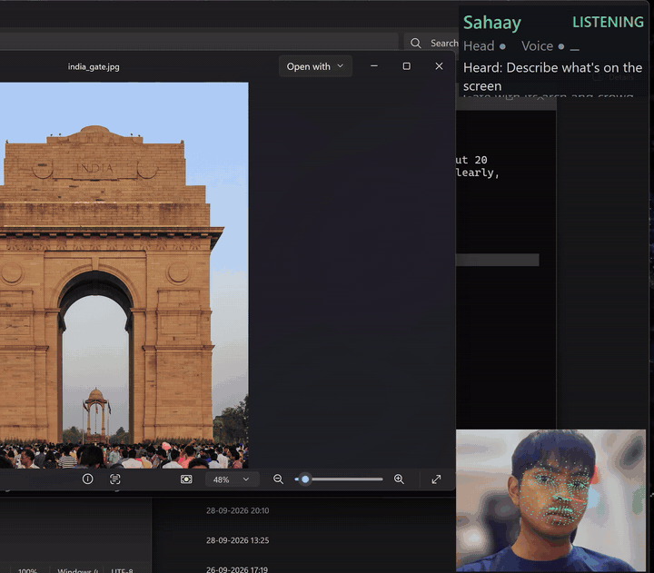

# Sahaay (सहाय)

**Your PC, hands-free and eyes-free. Six AI models, all on the Hexagon NPU, nothing leaves the laptop.**

Sahaay is an offline accessibility copilot for Snapdragon-powered Windows PCs such as the HP OmniBook and EliteBook. It gives people who cannot use a mouse or keyboard full control of Windows with their head and voice, and gives people who cannot see the screen a conversational narrator that reads, summarises and describes anything on it. Every neural network runs on the Qualcomm Hexagon NPU through Qualcomm AI Hub models, ONNX Runtime QNN and GenieX. The CPU only moves the mouse.

Built by Ruhan Srivastava for the Snapdragon AI Lab Build & Present Challenge 2026.

> **TLDR**
> - Head pose from a 468-point face mesh drives the cursor; blinks, dwell and mouth gestures click and drag. Whisper turns speech into dictation and commands. Qwen3-4B turns free speech into Windows actions. Qwen3-VL describes the screen and the webcam. Piper speaks back in English and Hindi.
> - All of it runs on the NPU at the same time: face tracking in under 1 ms per frame, speech in about 100 ms per sentence, language model at 33 tokens per second, vision-language model at 30 tokens per second, on this machine. Measured, not estimated: see `benchmarks/`.
> - Fits the 16 GB, 45 TOPS OmniBook a judge owns, and a 60,000 rupee laptop becomes an assistive device that otherwise costs over 1.5 lakh and needs the cloud.

## Demo

| Hands-free mode | Narrator mode |
|---|---|
|  |  |
| Head moves the cursor, a blink clicks, "open notepad and type a thank-you note" does the rest | "What's on my screen?", "read this", "describe the picture", "what do you see?" |

## Why this has to run on the device

| Need | Cloud assistant | Sahaay on the NPU |
|---|---|---|
| A camera watching your face all day, a screen showing your bank statement | Uploaded frame by frame | Never leaves RAM |
| Cursor latency people can tolerate | 100 ms or more, network dependent | Under 1 ms per frame, 28 fps |
| Works in a hostel, a hospital, a train, a village with patchy 4G | No | Yes, fully offline after install |
| Battery on a laptop that is the user's only interface | CPU or GPU inference drains it | NPU runs the whole stack at a few watts |
| Cost to the user | Subscription, per-minute speech APIs | Zero, forever |

Qualcomm India has said the goal is Snapdragon PCs below 60,000 rupees for students; HP India positions the OmniBook 3 and 5 at exactly that audience. India has 2.68 crore people with disabilities (Census 2011), roughly a fifth with movement disabilities and a fifth with visual disabilities. A free download that makes that laptop usable without hands or eyes is the point of an NPU.

## What Sahaay does

**Hands-free mode (motor impairment: spinal injury, ALS, cerebral palsy, RSI, a broken arm)**

- Joystick-style head cursor: nudge your head past a small dead zone and the cursor moves with speed proportional to the angle, so a comfortable neutral pose is still. Exponential smoothing kills jitter. Auto-calibrates in the first second, recalibrates on request.
- Clicks without hands: dwell (hold still for 0.9 s, a ring shows progress), short blink = left click, long blink = right click, open your mouth for a moment = start or stop dragging.
- Dictation into any application, English and Hindi.
- 25 instant voice commands (click, right click, scroll down a lot, press ctrl s, open Chrome, next window, close window, select all, copy, paste, undo, pause, resume, calibrate, ...) matched in under a millisecond without the language model.
- Free-form commands through the language model: "open my downloads", "write a short thank-you note to my teacher and save the file", "click the sign in button", "close this without saving". The model sees a compact list of the on-screen controls from Windows UI Automation and returns strictly validated JSON tool calls.
- Optional physical switch access through an Arduino (see below) for people who cannot use the camera.

**Narrator mode (low vision, blindness)**

- "What's on my screen": the UI Automation tree is summarised by the language model into two spoken sentences: which app, what content, which buttons matter.
- "Read this": reads the focused element or paragraph.
- "Describe the screen" or "describe the picture": the vision-language model describes what accessibility trees cannot: images, charts, photos, canvases, games.
- "What do you see": describes the webcam view, reads labels and signs.
- Every hands-free action is confirmed by voice, so a blind user always knows what just happened.
- Global hotkeys (Ctrl+Alt+H head, Ctrl+Alt+V voice, Ctrl+Alt+C calibrate, Ctrl+Alt+Q quit), a tray icon and a small heads-up panel that shows what Sahaay heard, what it did, and the live latency of each model with the compute unit that ran it.

## Overview: how it works

```
 webcam ─► Face detector + 468-pt mesh (NPU) ─► head pose, blink, mouth ─► cursor, clicks, drag (CPU, Win32)
                                                                          
 mic ─► voice activity detection (CPU) ─► Whisper base (NPU) ─► text ─┬─► fast grammar (CPU, <1 ms) ──┐
                                                                     └─► Qwen3-4B tool planner (NPU) ─┤
                                                                                                      ▼
 screen ─► UI Automation tree (CPU) ─────────────────────────────────────────────► action executor (CPU)
        └► screenshot ─► Qwen3-VL-4B (NPU) ─► description                         click, type, keys, open,
 webcam frame ─────────► Qwen3-VL-4B (NPU) ─► description                         focus, scroll, read
                                                                                          │
 speaker ◄── Piper TTS en / hi ◄──────────────────────────────────────────────────────────┘
 Arduino switches ─► JSON over USB serial ─► clicks, push-to-talk, pause (optional)
```

Two-tier command handling keeps the app feeling instant. Common commands never touch the language model. Anything else goes to Qwen3-4B with the screen's control list as context and a fixed tool schema; every returned call is validated against the schema and an allow-list before it runs.

## Software and hardware

**Languages:** Python 3.12 (ARM64 native), a little Arduino C++.

**Frameworks and tools**
- ONNX Runtime 1.30 with the Qualcomm QNN execution provider (`onnxruntime-qnn` 2.6, HTP backend) for the face, speech and TTS graphs
- Qualcomm GenieX 0.7 (QAIRT runtime) for the language and vision-language models
- Qualcomm AI Hub (`qai_hub`, `qai_hub_models` 0.63) to compile and profile every ONNX model for Snapdragon X Elite and X2 Elite
- Windows UI Automation (`uiautomation`), Win32 `SendInput` via ctypes, `pynput` for hotkeys and keys, DirectShow via `pygrabber` for the camera (OpenCV has no Windows ARM64 wheel), `sounddevice` for audio, Tkinter for the overlay, `pystray` for the tray
- espeak-ng for phonemisation, Hugging Face `transformers` for the Whisper tokenizer and mel features (CPU)

**AI runtime:** Qualcomm AI Engine Direct (QNN HTP) underneath both ONNX Runtime QNN EP and GenieX.

**Hardware used for development:** ASUS Zenbook A16, Snapdragon X2 Elite Extreme (18 cores, Hexagon NPU, 48 GB). Target hardware: any Snapdragon X, X Plus, X Elite, X2 Plus or X2 Elite PC including the HP OmniBook X, OmniBook 5, OmniBook 3, OmniBook Ultra and EliteBook Ultra. Optional: Arduino UNO Q or any Arduino for switch access.

## Models implemented

| Job | Model | Source | Precision | Runtime | Where it runs |
|---|---|---|---|---|---|
| Face detection | BlazeFace (`mediapipe_face` detector) | Qualcomm AI Hub | fp16 on HTP | ONNX Runtime QNN EP | NPU |
| 468-point face mesh, head pose, blink, mouth | `mediapipe_face` landmark detector | Qualcomm AI Hub | fp16 on HTP | ONNX Runtime QNN EP | NPU |
| Speech to text (English, Hindi) | `whisper_base` encoder + KV-cache decoder | Qualcomm AI Hub, precompiled QNN ONNX | fp16 | ONNX Runtime QNN EP | NPU |
| Intent to tool calls, screen summaries | `qwen3_4b_instruct_2507` | Qualcomm AI Hub NPU bundle via GenieX | 4-bit weights | GenieX (QAIRT) | NPU |
| Screen and camera description | `qwen3_vl_4b_instruct` | Qualcomm AI Hub NPU bundle via GenieX | 4-bit weights | GenieX (QAIRT) | NPU |
| Text to speech | Piper `en_US-lessac-medium`, `hi_IN-pratham-medium` | rhasspy/piper-voices | fp32 | ONNX Runtime | CPU (see notes) |

No fine-tuning was needed. The face and Whisper models were exported with `qai-hub-models ... export` for both `Snapdragon X2 Elite CRD` (this laptop, Hexagon v81) and `Snapdragon X Elite CRD` (the OmniBook chip, Hexagon v73); the installer picks the right set. The language models are Qualcomm's own NPU bundles pulled with `geniex-py pull ai-hub-models/...`.

Notes: the Piper VITS graph has dynamic shapes that the QNN compiler rejects, so it runs on the CPU today (230 ms for 4 s of audio, 16x real time); Qualcomm AI Hub lists a `pipertts_en` recipe that is the NPU path for the next version. Whisper mel features and tokenisation are CPU by design.

## Compute cores used

- **NPU (Hexagon):** face detector, face mesh, Whisper encoder and decoder, Qwen3-4B, Qwen3-VL-4B. Everything that is a neural network.
- **CPU (Oryon):** camera capture, voice activity detection, mel spectrogram, UI Automation tree walking, the command grammar, JSON validation, cursor maths and `SendInput`, the overlay, Piper TTS.
- **GPU (Adreno):** deliberately nothing. The user's own applications keep the GPU.

The concurrency matters: while the language model is planning an action and the vision model is describing the screen, the face mesh keeps the cursor alive at 28 fps and Whisper keeps listening, all on the same NPU. This is what an 80 TOPS X2 was announced for, and the whole stack still fits a 45 TOPS first-generation OmniBook.

## Performance

Measured on the development machine with `tools/bench_all.py` (full tables and raw JSON in `benchmarks/`). The NPU column is only reported when ONNX Runtime confirms `QNNExecutionProvider` is the active provider; `tools/npu_check.py` prints that proof and is the first thing a reviewer should run.

| Stage | CPU | NPU | Note |
|---|---:|---:|---|
| Face detector (256x256) | 2.97 ms | 0.42 ms | 7x |
| Face mesh (192x192) | 1.01 ms | 0.16 ms | 6x |
| Full face pipeline, live 1280x720 | | 2.7 ms/frame | 28 fps, camera-bound |
| Whisper base encoder (30 s window) | | 25 ms | |
| Whisper base decoder | | 3 ms/token | a 6 s command in about 100 ms |
| Qwen3-4B-Instruct (GenieX) | | 60 ms to first token, 33 tok/s | 8 to 12 s to load |
| Qwen3-VL-4B-Instruct (GenieX), screen description | | 280 ms to first token, 30 tok/s, 2.3 s total | 8 to 10 s to load |
| Piper TTS, 4 s of speech | 230 ms | | 16x real time |

Qualcomm AI Hub profiling on the reference devices (cloud device farm, every op on the NPU, job links in `benchmarks/aihub_profiles.md`):

| Model | Snapdragon X2 Elite CRD | Snapdragon X Elite CRD (HP OmniBook X, EliteBook) |
|---|---:|---:|
| Face detector | 0.4 ms | 0.7 ms |
| Face mesh | 0.2 ms | 0.3 ms |
| Whisper base encoder | 21.5 ms | 45.4 ms |
| Whisper base decoder, per token | 2.4 ms | 3.7 ms |

On a judge's OmniBook that is about 1 ms per frame for face tracking and about 120 ms to transcribe a six-second command. Memory: the two GenieX bundles resident together take about 5 GB; the whole app fits comfortably in a 16 GB OmniBook.

## Deployment

**Install (one time, needs internet):**

```powershell
git clone https://github.com/Vision-jarvis/sahaay.git
cd sahaay
powershell -ExecutionPolicy Bypass -File install.ps1
```

`install.ps1` installs ARM64 Python 3.12 if missing, creates a virtual environment, installs the requirements, downloads the models for your chipset (about 6 GB, one time), installs espeak-ng, and adds a Start Menu shortcut. Everything after that is offline.

**Run:** `run.bat`, or the Start Menu shortcut. Options: `--no-vlm` (skip the vision model on 16 GB machines that need the RAM), `--lang hi`, `--no-head`, `--no-voice`, `--port COM5` for an Arduino switch.

**Requirements:** Windows 11 on Snapdragon (X, X Plus, X Elite, X2). 16 GB RAM recommended. Webcam and microphone. No admin rights, no cloud account.

**Verify the NPU:** `py -3.12 tools/npu_check.py` prints the execution providers and a CPU versus NPU timing for every ONNX model; `py -3.12 tools/bench_all.py` regenerates `benchmarks/results.md`.

## Development flow

1. Toolchain proof: ONNX Runtime QNN on ARM64 Python, AI Hub account, GenieX and Foundry Local installed, one conv net timed CPU vs NPU. Found that the common `providers=["QNNExecutionProvider"]` call silently runs on the CPU with the current plugin runtime; wrote `sahaay/npu.py` to register the plugin, select the NPU device explicitly and assert the active provider.
2. Face tracking: exported `mediapipe_face` for X2 Elite, re-implemented Qualcomm's MediaPipe pre- and post-processing in numpy and Pillow (no OpenCV on ARM64), added head pose, eye aspect ratio and mouth metrics. 28 fps live.
3. Head cursor: joystick mapping, dead zone, exponential gain, dwell ring, blink and mouth gestures, calibration.
4. Speech: exported `whisper_base` as precompiled QNN ONNX, wrote the KV-cache decode loop in numpy, energy VAD on the mic.
5. Brain: two-tier command handling; GenieX Qwen3-4B with a strict tool schema and a UI Automation screen snapshot; argument normalisation and an allow-list.
6. Narrator: screen summaries, focused text, Qwen3-VL screen and camera descriptions, Piper TTS in English and Hindi via espeak-ng.
7. App: threads for camera, voice, model loading; overlay, tray, hotkeys, logging; sequential GenieX loads (concurrent loads fail to create HTP contexts).
8. Deployment: installer, first-run model fetcher with chipset detection, benchmark suite, Arduino bridge, this README, deck.

## Easy parts and hard parts

Easy: Qualcomm AI Hub. Every model exported and profiled on a real Snapdragon X2 Elite and X Elite in minutes, with per-op compute-unit reports. GenieX made the language and vision models a `pip install` and one `pull`; both ran on the NPU first try at 30+ tokens per second.

Hard: the plumbing around the models on Windows ARM64. OpenCV has no wheel, so the camera goes through DirectShow COM and every worker thread must call `CoInitialize`. The Piper wheel's espeak bridge is not built for ARM64, so phonemisation shells out to espeak-ng and the VITS graph is driven directly through ONNX Runtime. QNN context caching must reuse the cached file on the second launch rather than regenerate it. Two GenieX models cannot be loaded at the same moment. The QNN provider must be selected through the new device API or ONNX Runtime quietly falls back to the CPU, which is probably why so many "NPU" projects report CPU numbers.

## Sahaay Bridge: switch access with an Arduino

Snapdragon AI Lab pairs the PC with the Arduino UNO Q. For accessibility the meaningful pairing is switch access: one or two big buttons, or a sip-and-puff sensor, for people who cannot use a camera. `arduino/sahaay_switch` turns any Arduino into a Sahaay switch interface over USB serial with a five-line JSON protocol (tap = click, hold = drag, push-to-talk, pause). It is auto-detected at startup and can be tried without hardware in the Wokwi simulator. Details in `arduino/README.md`.

## Privacy and safety

No network calls at runtime. Frames, audio and screenshots are processed in memory and discarded. Language-model actions are validated against a fixed schema and an allow-list; the model cannot invent tools or click elements that are not on screen. Destructive shortcuts (close window, delete) only run from explicit fast-grammar commands, and every action is announced by voice.

## Roadmap

Gaze estimation (`eyegaze` on AI Hub) for coarse screen-region selection, Piper on the NPU, Hindi and Hinglish command grammar, element grounding from the vision model ("click the blue button"), OmniBook presence-sensor auto-pause, an MSIX package.

## Repository layout

```
sahaay/            the app: npu.py (QNN session factory), brain.py, screen.py, tts.py, app.py
  vision/          camera.py, face.py (NPU face mesh), describe.py (NPU VLM)
  speech/          whisper.py (NPU ASR), mic.py (VAD)
  control/         cursor.py (head cursor), actions.py (executor), win32.py
  ui/              hud.py, tray.py
  bridge.py        Arduino switch protocol
tools/             npu_check.py, bench_all.py, get_models.py, face_demo.py, asr_demo.py, head_mouse.py
benchmarks/        measured results (json + md)
arduino/           sahaay_switch sketch and protocol
docs/              media, pitch deck, project description
install.ps1, run.bat, requirements.txt
```

## License and acknowledgements

MIT. Models: Qualcomm AI Hub (MediaPipe Face, Whisper, Qwen3 bundles, under their respective licenses), rhasspy Piper voices (MIT), espeak-ng (GPL, used as a separate executable). Thanks to the Qualcomm AI Hub and GenieX teams for making the Hexagon NPU reachable from Python.
