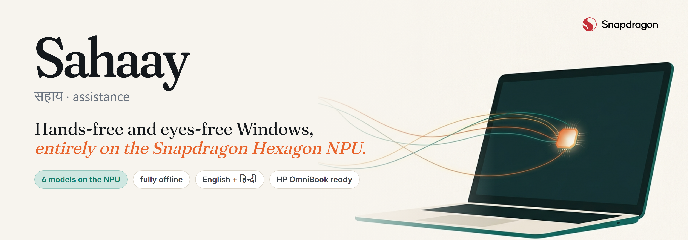
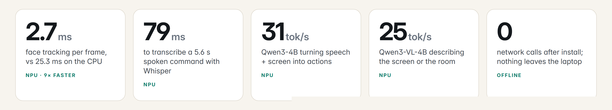
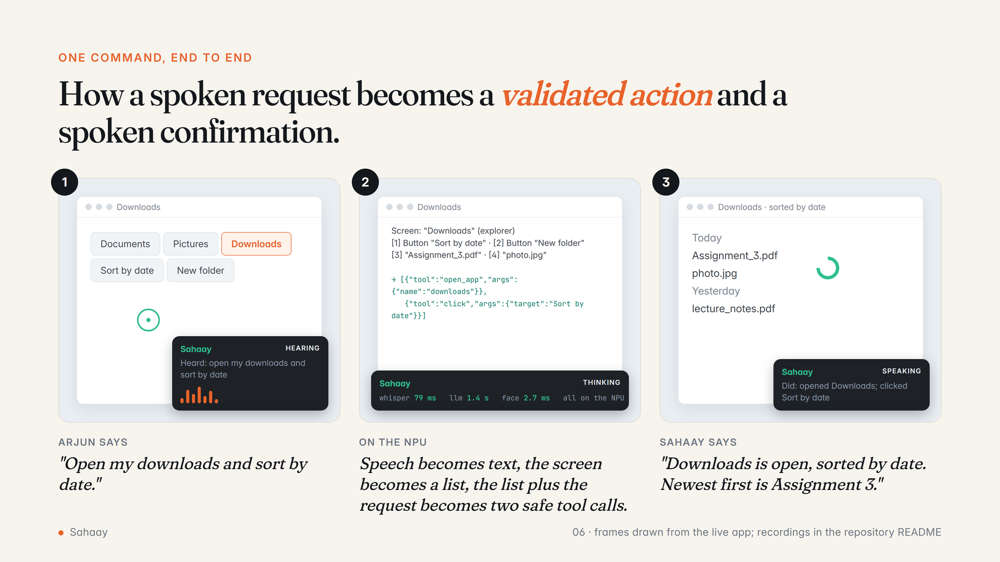
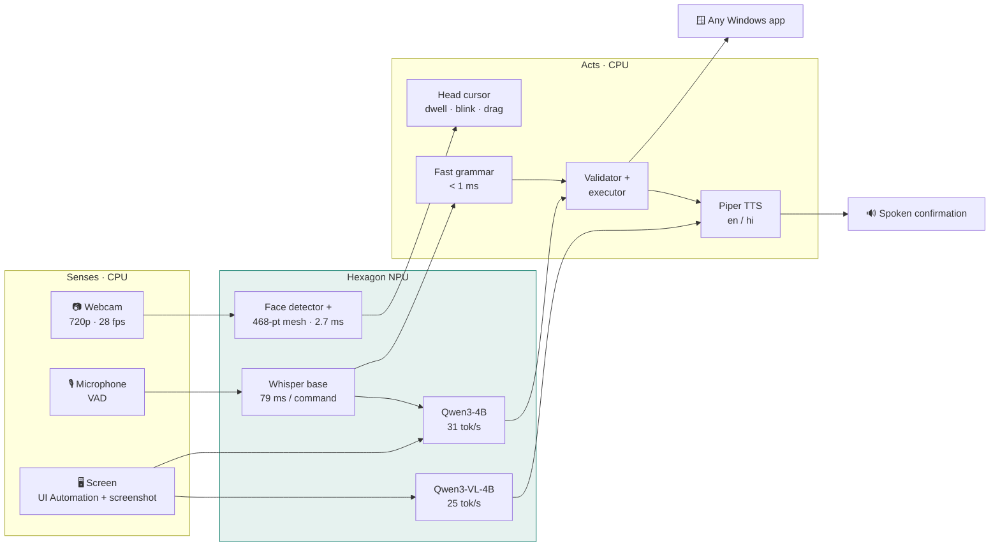
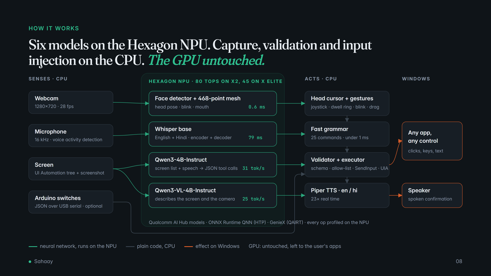
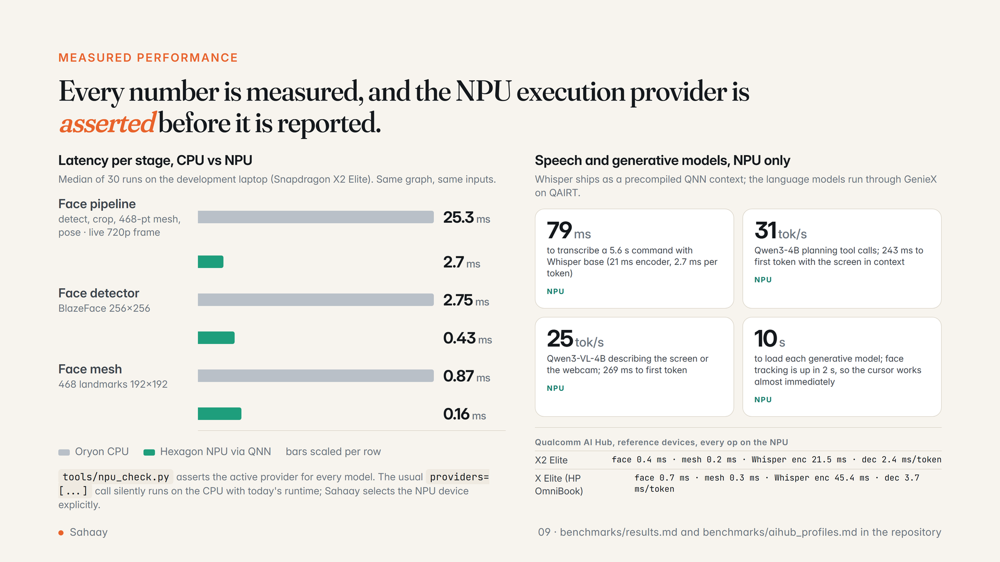
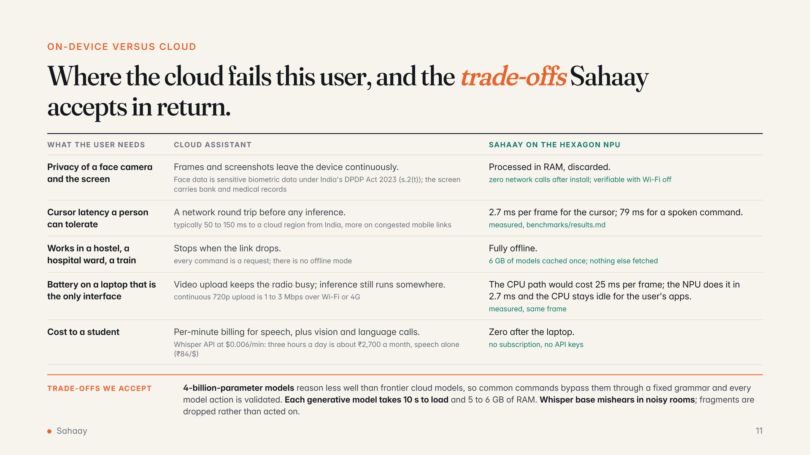
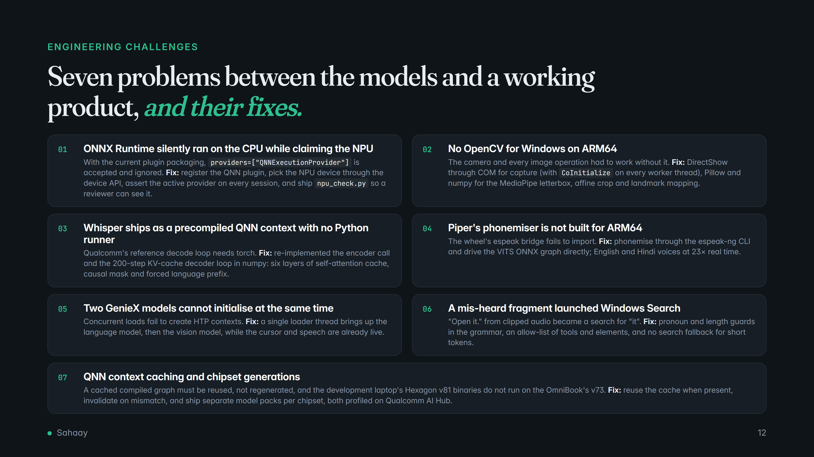

<p align="center">
  
</p>

<p align="center">
  
  
  
  
  
  
  
</p>

<p align="center">
  <b>Sahaay</b> (सहाय, "assistance") lets people who cannot use a mouse or keyboard control Windows with their head and voice,<br>
  and lets people who cannot see the screen ask it what it says. Six AI models, all on the NPU of a Snapdragon HP PC. Nothing leaves the laptop.
</p>

<p align="center">
  <a href="#-see-it">See it</a> ·
  <a href="#-how-it-works">How it works</a> ·
  <a href="#-measured-on-the-npu">Benchmarks</a> ·
  <a href="#-install">Install</a> ·
  <a href="#-engineering-challenges">Challenges</a> ·
  <a href="docs/deck/Sahaay_Pitch.pdf">Pitch deck (PDF)</a>
</p>



Built by **Ruhan Srivastava** (IIT Kharagpur) for the **Snapdragon AI Lab Build & Present Challenge 2026**.

---

## 🎬 See it

<!-- DEMO:START -->
<table>
<tr>
<td width="50%"></td>
<td width="50%"></td>
</tr>
<tr>
<td align="center"><b>Hands-free:</b> head pose from the 468-point NPU face mesh (bottom right) moves the cursor</td>
<td align="center"><b>Narrator:</b> "describe what's on the screen" answered by Qwen3-VL-4B on the NPU</td>
</tr>
</table>


<!-- DEMO:END -->

| 🖐️ Hands-free mode | 👁️ Narrator mode |
|---|---|
| **Head cursor:** nudge your head, the cursor moves; hold still, it stays | **"What's on my screen?"** Two spoken sentences: app, content, what matters |
| **Clicks without hands:** blink, dwell ring, open mouth to drag | **"Read this."** The focused paragraph or field, aloud |
| **Dictation** into any app, English and Hindi | **"Describe the picture."** Qwen3-VL explains photos, charts, canvases |
| **25 instant commands** in under 1 ms: click, scroll, press ctrl+s, next window | **"What do you see?"** The webcam view, labels, signs |
| **Free-form:** *"open my downloads and sort by date"* | **Every action confirmed by voice**, so a blind user always knows |
| **Arduino switches** for people who cannot use the camera | English and Hindi voices, generated on the laptop |

---

## 🧠 How it works





<details>
<summary><b>Models and runtimes</b></summary>

| Job | Model | Source | Runtime | Unit |
|---|---|---|---|---|
| Face detection | BlazeFace (`mediapipe_face`) | Qualcomm AI Hub | ONNX Runtime + QNN EP | NPU |
| 468-pt mesh, pose, blink, mouth | `mediapipe_face` landmarks | Qualcomm AI Hub | ONNX Runtime + QNN EP | NPU |
| Speech to text, en + hi | `whisper_base`, precompiled QNN | Qualcomm AI Hub | ONNX Runtime + QNN EP | NPU |
| Commands and screen summaries | `qwen3_4b_instruct_2507` | Qualcomm AI Hub bundle | GenieX (QAIRT) | NPU |
| Screen and camera description | `qwen3_vl_4b_instruct` | Qualcomm AI Hub bundle | GenieX (QAIRT) | NPU |
| Text to speech | Piper `en_US-lessac`, `hi_IN-pratham` | rhasspy/piper-voices | ONNX Runtime | CPU |

Every ONNX model was compiled and profiled for **Snapdragon X2 Elite** and **Snapdragon X Elite** (the HP OmniBook chip) on Qualcomm AI Hub; the installer picks the matching pack. Common commands never touch the language model; everything else goes to Qwen3-4B with the live control list and a fixed JSON tool schema, and every returned call is checked against an allow-list before it runs.
</details>

---

## 📊 Measured on the NPU



| Stage | CPU | NPU | |
|---|---:|---:|---|
| Face pipeline, live 720p frame | 25.3 ms | **2.7 ms** | 9× |
| Face detector | 2.75 ms | **0.43 ms** | 6.4× |
| Face mesh | 0.87 ms | **0.16 ms** | 5.3× |
| Whisper, 5.6 s command | n/a (QNN context) | **79 ms** | |
| Qwen3-4B | | **243 ms** first token · **31 tok/s** | |
| Qwen3-VL-4B | | **269 ms** first token · **25 tok/s** | |

Qualcomm AI Hub, every op on the NPU: X Elite face 0.7 ms, mesh 0.3 ms, Whisper encoder 45.4 ms, decoder 3.7 ms/token. Full tables and job links: [`benchmarks/results.md`](benchmarks/results.md), [`benchmarks/aihub_profiles.md`](benchmarks/aihub_profiles.md).

> [!IMPORTANT]
> With today's plugin runtime, `providers=["QNNExecutionProvider"]` is silently ignored and inference runs on the CPU. Sahaay registers the QNN plugin, selects the NPU device explicitly and asserts it. Check it yourself: `py -3.12 tools/npu_check.py`.

---

## ☁️ Why on-device



---

## 🚀 Install

```powershell
git clone https://github.com/Vision-jarvis/sahaay.git
cd sahaay
powershell -ExecutionPolicy Bypass -File install.ps1   # one time, ~6 GB of models
run.bat                                                 # fully offline from here
```

| | Hands-free mode | Everything (+ vision model) |
|---|---|---|
| **RAM** | 16 GB (OmniBook 3, 5) | 32 GB (OmniBook X, Ultra) or `--no-vlm` / 2B vision model on 16 GB |
| **NPU** | 45 TOPS (Snapdragon X, X Plus, X Elite) | 80 TOPS on X2 gives headroom |

Options: `--lang hi`, `--no-vlm`, `--no-head`, `--no-voice`, `--port COM5` (Arduino switch). Hotkeys: <kbd>Ctrl</kbd>+<kbd>Alt</kbd>+<kbd>H</kbd> head, <kbd>V</kbd> voice, <kbd>C</kbd> calibrate, <kbd>Q</kbd> quit.

---

## 🛠️ Engineering challenges



---

## 🔌 Sahaay Bridge: switch access with an Arduino

For people who cannot use a camera, any Arduino (including the UNO Q from the Snapdragon AI Lab kit) becomes a one- or two-button interface over USB serial: tap to click, hold to drag, push-to-talk, pause. Five-line JSON protocol, auto-detected, testable in the Wokwi simulator. See [`arduino/`](arduino/).

---

## 🗺️ Roadmap

- [ ] Gaze estimation on the NPU (AI Hub `eyegaze`) for users with very limited neck movement
- [ ] Piper on the NPU; Hindi and Hinglish command grammar ("neeche scroll karo")
- [ ] Element grounding from the vision model for apps without an accessibility tree
- [ ] Trials with an assistive-technology centre; tremor calibration profiles
- [ ] MSIX package; OmniBook presence-sensor auto-pause

<details>
<summary><b>Repository layout</b></summary>

```
sahaay/            npu.py (QNN session factory) · brain.py · screen.py · tts.py · app.py · bridge.py
  vision/          camera.py · face.py (NPU face mesh) · describe.py (NPU VLM)
  speech/          whisper.py (NPU ASR) · mic.py (VAD)
  control/         cursor.py · actions.py · win32.py
  ui/              hud.py · tray.py
tools/             npu_check.py · bench_all.py · get_models.py · record_demo.py · face_demo.py · asr_demo.py
benchmarks/        measured results + AI Hub profile jobs
docs/              deck (HTML → PPTX/PDF), description, README infographics, media
arduino/           switch sketch + protocol
```
</details>

**Privacy.** No network calls at runtime. Frames, audio and screenshots are processed in memory and discarded. **License** MIT. Models under their respective licenses (Qualcomm AI Hub, rhasspy Piper voices; espeak-ng used as a separate executable). Demo photo: India Gate, Wikimedia Commons, Free Art License.
